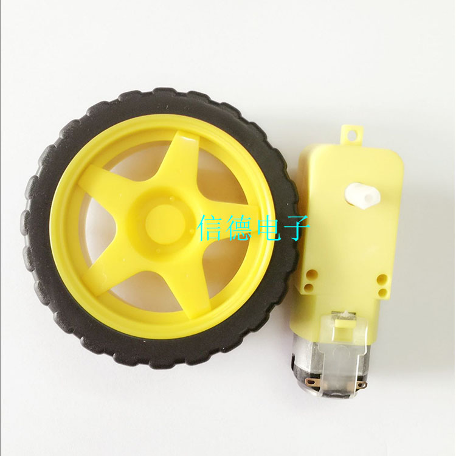

# Final Project: A DONOT TOUCH ME Robot

## 1. Introduction
 A DONOT TOUCH ME Robot says “DO NOT TOUCH ME” and try to run away when you attempt to touch it. Also, the robot may hold a grudge and after several times of being touched, it will “get angry”.

## 2. Design Part

### 2.1 Mechanical Design
#### 2.1.1 Wheels
Since the mechanical part can be complicated for me, the teacher suggested me to buy some well-designed part online. Therefore, I bought the wheels as long as DC motor and corresponding part from [the store in taobao](http://m.tb.cn/h.x6WVND)

#### 2.1.2 Body of the robot
Actually, I treat it as the most difficult part for me since I have no experience before. Then I found a useful [website](http://www.makercase.com/) to design the box, and below is the parameter that I chose. Actually, I have made a lot mistakes since I am not familiar with the concept of [Laser Cutting Kerf](http://bestia.one/laserCutter.html) and waste some material. Actually the parameter below is not perfect, it is to tight for a box. I think 0.15 is a good value to try.
 

Then I designed some holes to make it possible to attach the wheels. Also the big holes are designed to fit the distance sensor (although it is not symmetrical). In addtion, You may download the [source file here](box.zip)

### 2.2 Electronic Design