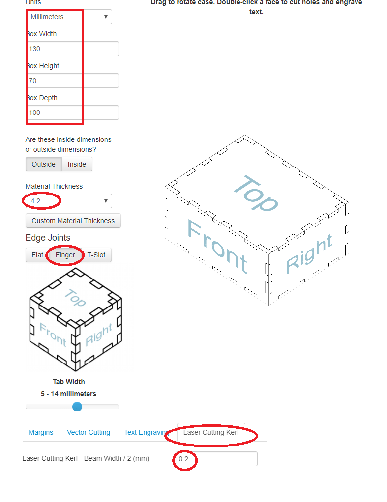
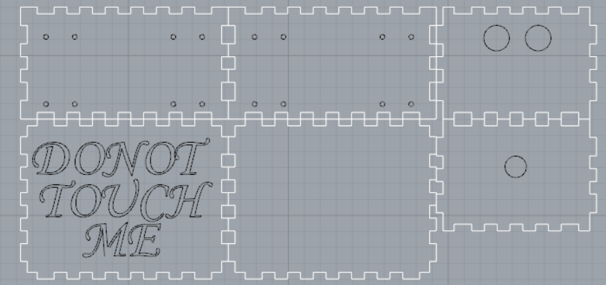
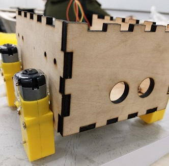
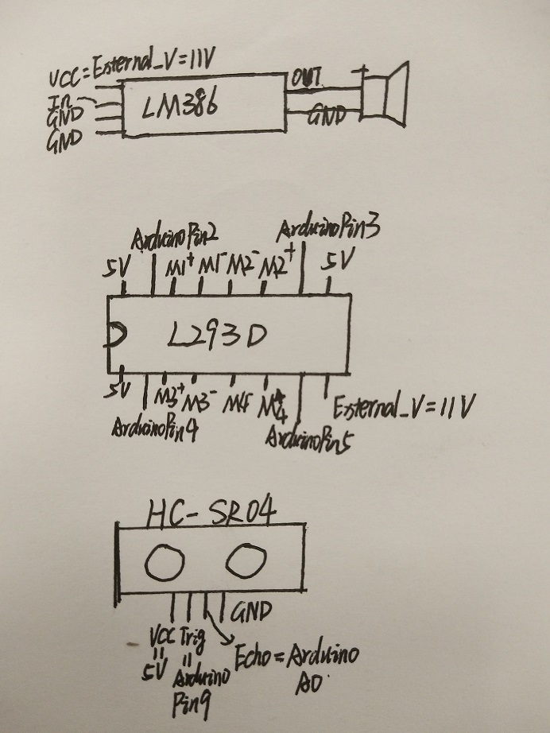
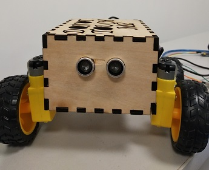
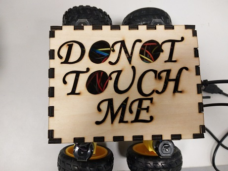

# Final Project: A DONOT TOUCH ME Robot


## 1. Introduction
 A DONOT TOUCH ME Robot says “DO NOT TOUCH ME” and try to run away when you attempt to touch it. Also, the robot may hold a grudge and after several times of being touched, it will “get angry”.

## 2. Design Part

### 2.1 Mechanical Design
#### 2.1.1 Wheels
Since the mechanical part can be complicated for me, the teacher suggested me to buy some well-designed part online. Therefore, I bought the wheels as long as DC motor and corresponding part from **[the store in taobao](http://m.tb.cn/h.x6WVND)**


#### 2.1.2 Body of the robot
Actually, I treat it as the most difficult part for me since I have no experience before. Then I found a useful **[website](http://www.makercase.com/)** to design the box, and below is the parameter that I chose. Actually, I have made a lot mistakes since I am not familiar with the concept of **[Laser Cutting Kerf](http://bestia.one/laserCutter.html)** and waste some material. Actually the parameter below is not perfect, it is to tight for a box. I think 0.15 is a good value to try.
 


Then I designed some holes to make it possible to attach the wheels. Also the big holes are designed to fit the distance sensor (although it is not symmetrical). In addtion, You may download the **[source file here](box.zip)**




### 2.2 Electronic Design

#### 2.2.1 Electronic Components Needed.
- Arduino that we made in [week7](../week7/week7.md)
- Piezo Sounders
- **[Risym LM386 (Audio amplifier module)](http://m.tb.cn/h.y63hGY)**
- **[L293D (H bridge)](http://www.ti.com/lit/ds/symlink/l293.pdf)**
- **[Ultrasonic Ranging Module](http://www.micropik.com/PDF/HCSR04.pdf)**
Here are some website useful to learn the some of components


#### 2.2.2 Electronic Schematic



#### 2.2.3 Program with arduino
##### 2.2.3.1 How to make the arduino speak
1. First, you should download **[the arduino library](http://www.lab-z.com/wp-content/uploads/2014/09/damellis-PCM-ae3f463.zip)**
2. Second, go to **[the website](http://vozme.com/index.php?lang=en)** to create a mp3 file that says "Don't touch me".
3. Now we have a .mp3 file, however, the PCM library only support playout .wav file, so we need **[the tool witchsetup](http://www.lab-z.com/wp-content/uploads/2014/09/switchsetup.zip)** to convert the .mp3 file to .wav file (**choose WAV 8000Hz Mono**).
4. Then we can encode the .wav file into arduino array using **[the tool EncodeAudio-windows](http://www.lab-z.com/wp-content/uploads/2014/09/EncodeAudio-windows.zip)**

##### 2.2.3.2 The Code
```c
#include "PCM.h"
int TrigerPin = 9 ; // output
int ReadPin = A0;
int delayTime = 100;
int MotorPin1 = 2;
int MotorPin2 = 3;
int MotorPin3 = 4;
int MotorPin4 = 5;
double threhold = 15;
double duration, range;
void DonotTouchMe();
void Fine();
void Backward();
void Stop();
int touchme_delay=600;
int dtouchme_delay=700;
int RunAwayTime =200;
int play_cnt=0;
void setup() {
  Serial.begin(9600);
  pinMode(TrigerPin, OUTPUT);
  pinMode(MotorPin1, OUTPUT);
  pinMode(MotorPin2, OUTPUT);
}


void loop() {
  digitalWrite(TrigerPin, HIGH);
  delay(10);
  digitalWrite(TrigerPin, LOW);
  duration = pulseIn(ReadPin, HIGH);
  range = duration / 2 / 29.1;
  Serial.println(range);
  if(play_cnt++>5)
  {
    stopPlayback();
    play_cnt=0;
    delay(100);
  }
  if (range < threhold && range!=0) DonotTouchMe();
  else Fine();
}

 
void DonotTouchMe()
{
  Backward();
  delay(RunAwayTime);
  Stop();
  delay(100);
  startPlayback(do_not_touch_me_data, sizeof(do_not_touch_me_data));
  delay(dtouchme_delay);
}


void Fine()
{
  Stop();
  startPlayback(touch_me_data, sizeof(touch_me_data));
  delay(touchme_delay);
}

void Backward()
{
  digitalWrite(MotorPin1, HIGH);
  digitalWrite(MotorPin2, HIGH);
  digitalWrite(MotorPin3, HIGH);
  digitalWrite(MotorPin4, HIGH);
}
void Stop()
{
  digitalWrite(MotorPin1, LOW);
  digitalWrite(MotorPin2, LOW);
  digitalWrite(MotorPin3, LOW);
  digitalWrite(MotorPin4, LOW);
}
```
**Also, Here is [my source file](src.zip)**
#### 2.2.4 Reference
- **[How to use H bridge with arduino](http://www.instructables.com/id/How-to-use-the-L293D-Motor-Driver-Arduino-Tutorial/)**
- **[How to make arduino speak](http://www.lab-z.com/arduinosound/)**

## 3 PLEASE DON'T TOUCH ME !!!




<video width="480" height="360" controls>
	<source src="demo.mp4"  type="video/mp4" />
	<object width="640" height="360" type="application/x-shockwave-flash" data="__FLASH__.SWF">
		<param name="movie" value="__FLASH__.SWF" />
		<param name="flashvars" value="controlbar=over&amp;image=__POSTER__.JPG&amp;file=demo.mp4" />
		
	</object>
</video>
<p>	<strong>Download Video:</strong>
	Closed Format:	<a href="demo.mp4">"MP4"</a>
</p>