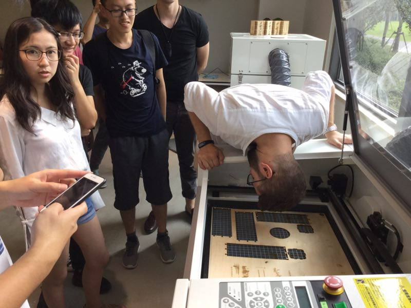
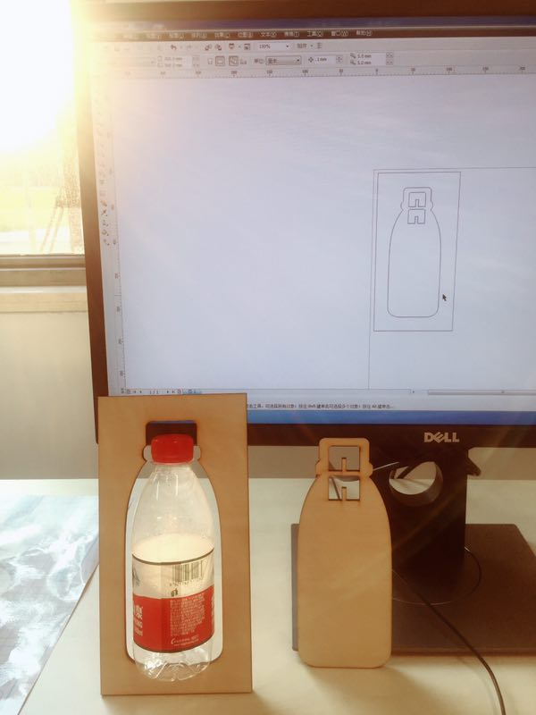
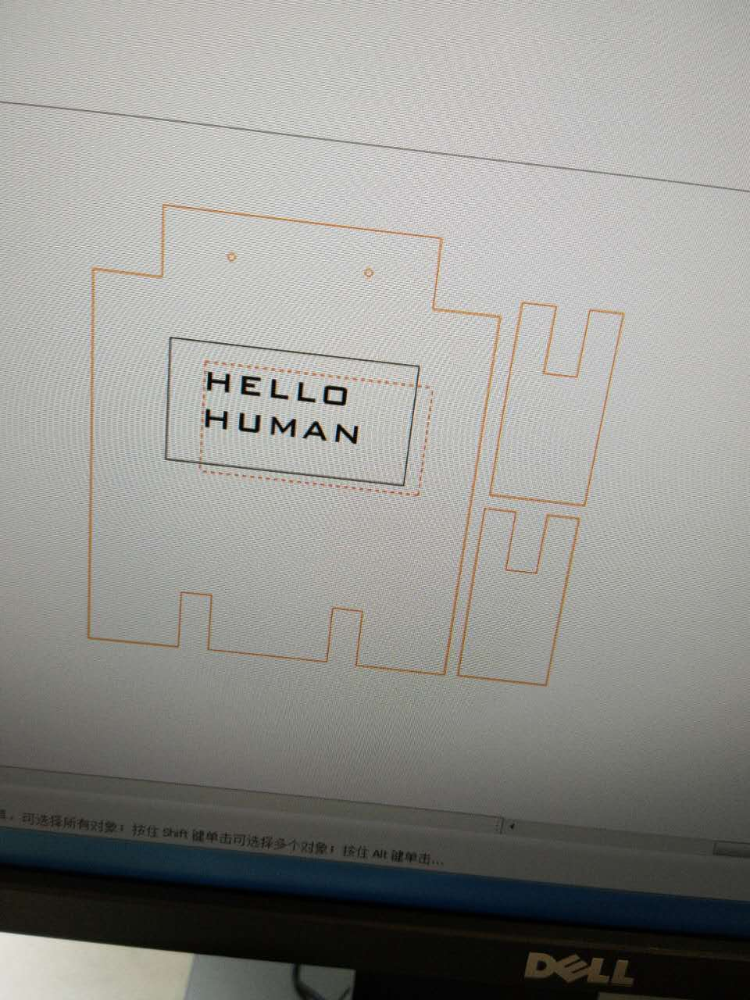
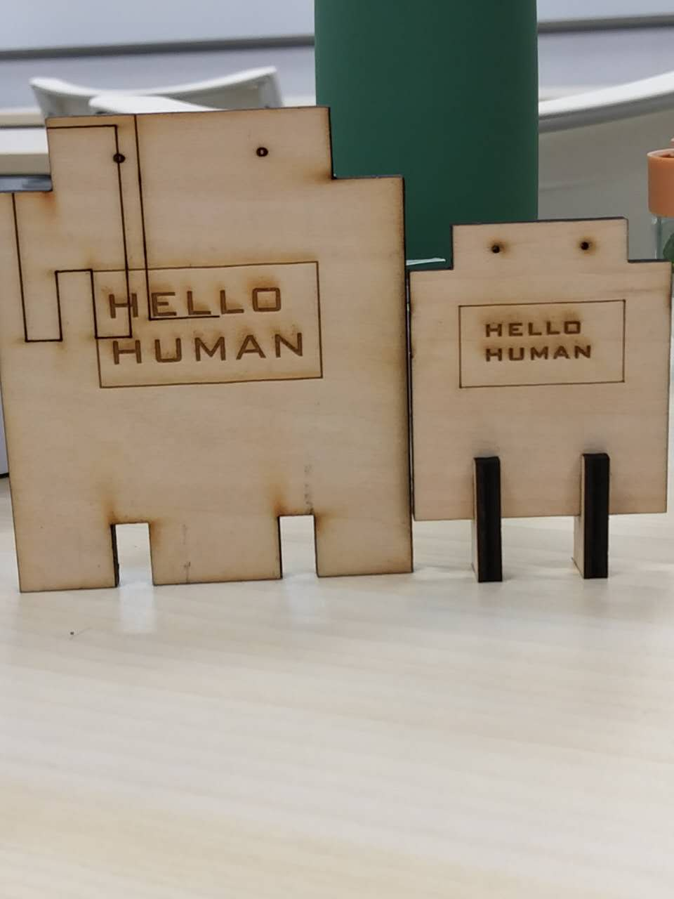
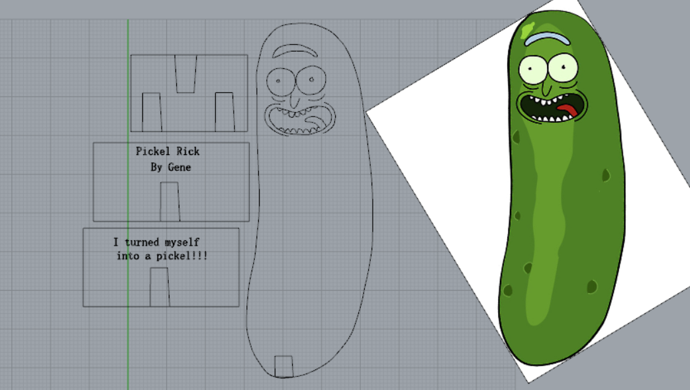
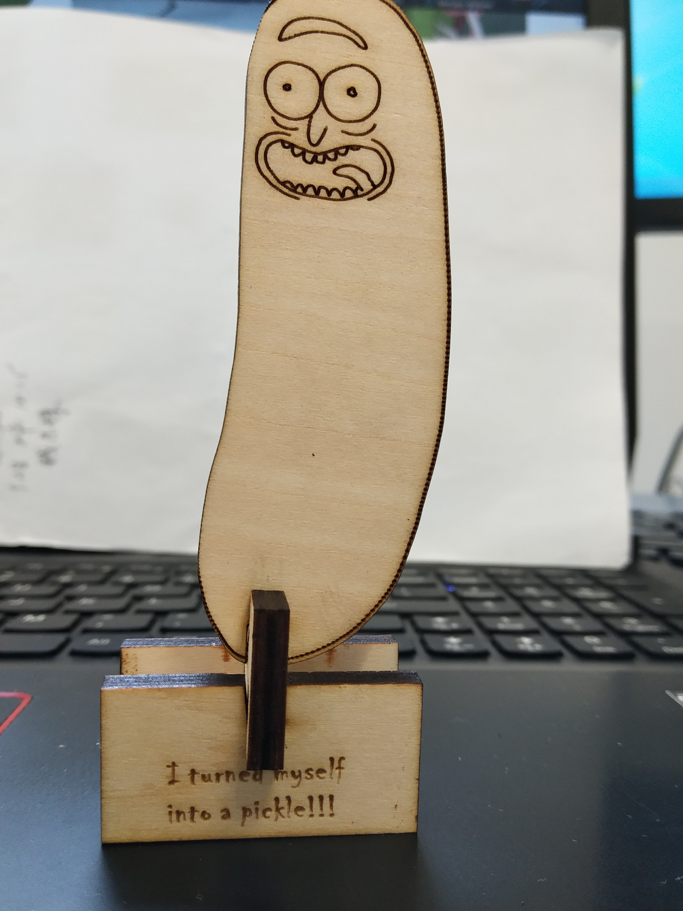

# WEEK2: Practice with Rhnio and LaserCut
## 1. What we learn in class
Basically, we learned about the detail of laser cut and how to do 2D design 
 with Rhino.
### 1.1 Rhino and laser cut mathine.
- Rhino is a powerful 2D/3D design software. In the class, we learned how to munipulate with line and curves. And the teacher used it to draw the outline of a water bottle and it was awesome.
More imformation about Rhino can be found in this [Chinese wbsite](http://www.xuexiniu.com/)
- There are a lot of things to learn about laser cut machine. Most of them comes from experience. However, there are something need to be known before we make practice.
	- There are some parameters that need to be set:
		- power: how much power the laser output
		- Speed: How fast the laser head travelling
		- PPI: Sometimes called frequency, how rapid the laser fires.
	- There are basically two type of work function: engraving and vector scoring.
	- KERF: The laser burns away a portion of material when it cut through.(typically 0.08-1mm, depends on material type, thicknee, and laser settings.

### 1.2 Some photos taken in the class

<strong>This is our teacher checking the laser cut machine</strong>

<strong>This is a small demostration our teacher made to illustrate the basic skills with Rhino</strong>

## 2. Make something in practice 
### 2.1 Test the machine
Here are imformation about what power and speed can cut through the wood(4.5mm).

|power| speed | can or not cut through 	|
| :----:| :----:| :----:					|
|70   |	1	  |yes						|
|65	  |	1	|yes						|
|80	  |2	|yes  						|
|78   |2    |no							|
### 2.2 A simple robot wooden model
Here is the design of my robot model in CDR. Actually when exporting dxf fiel from Rhino, there is something wrong with words, so I have to design the words in corel draw and here is my final design

It is quite simple but I have to change the total size slightly and keep trying to find the proper size of the joint. Below is my final product. You can also find my source file [here](design_source_file/myrobot.CDR)

### 2.3 A Pickel Rick 
#### 2.3.1 Where does the idea comes from?
It is a role character in an American adult animated science-fiction sitcom [Rick and Morty](https://en.wikipedia.org/wiki/Rick_and_Morty) Season 3 Episode 3. The genuious scientists Rick turns himself into a pickle and blabla..

#### 2.3.2 Things to do with Rhino
First, a download the image online and use the curve function to get the outline of the image. And then I try to design the joint part to make it stand.This part is a bit tricky since I am not try the thickness of the wooden board so I just put it roughly 4.5mm and try to resize it in corel draw.

#### 2.3.3 I turned myslef into a pickle!!! Isn't it awesome???
Also, you can find my source file here [CDR file](design_source_file/pickelRick.cdr) and  [DXF file](design_source_file/pickelRick.dxf)

### 2.4 In Addtion, here are some vedios of the process of the laser cutting.

[Simple robot](a.mp4)

[Pickel rick](PickelRick/a.mp4)

[GO BACK TO INDEX](index.md)

