# WEEK3: Practice of 3D printer 

## 1. Test of the 3D printer
Below is the general view of the test result(by building some basic shapes) and it is made of four parts.

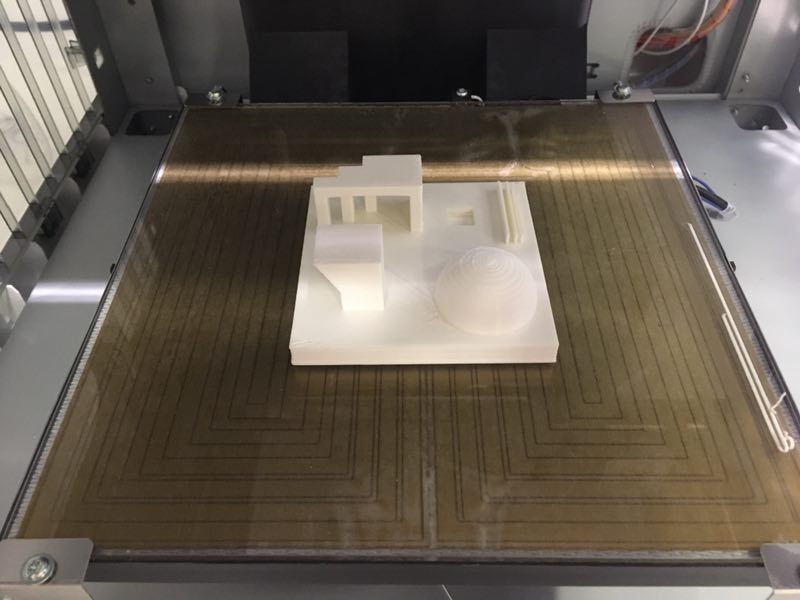
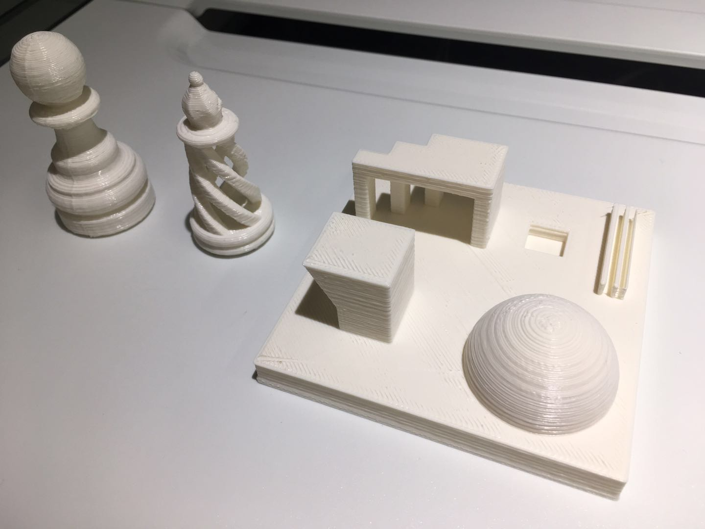
### 1.1 Hemisphere
The teacher create a hemisphere using 3D printer and it comes out pretty well.

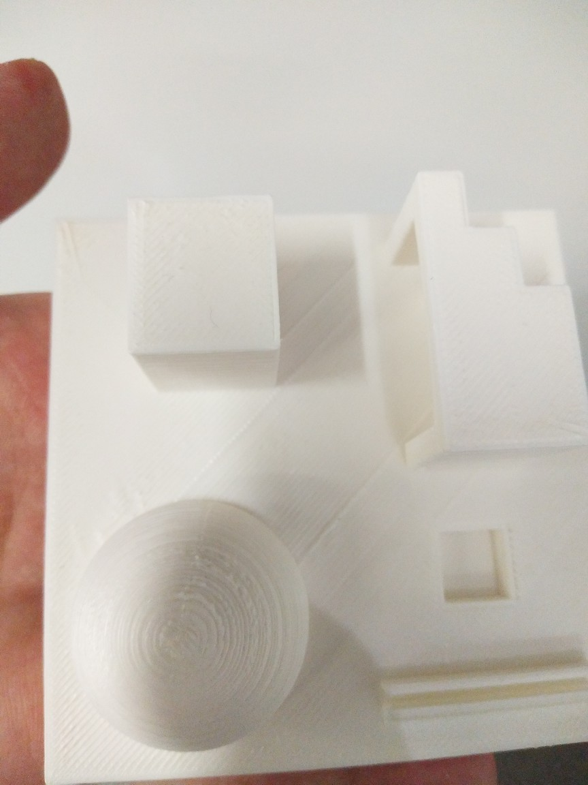

### 1.2 Support 
The material cannot be built into air so to achieve the shape below, we must design the slope as shown in the picture.

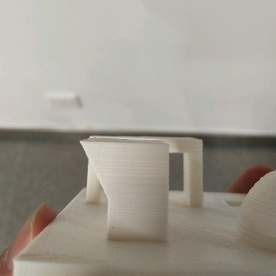

### 1.3 Bridge
We can also build the bridge below but we should be careful to avoid the support failure.

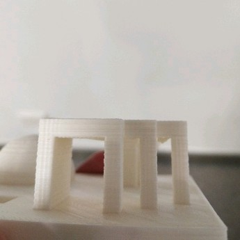

### 1.4 Groove

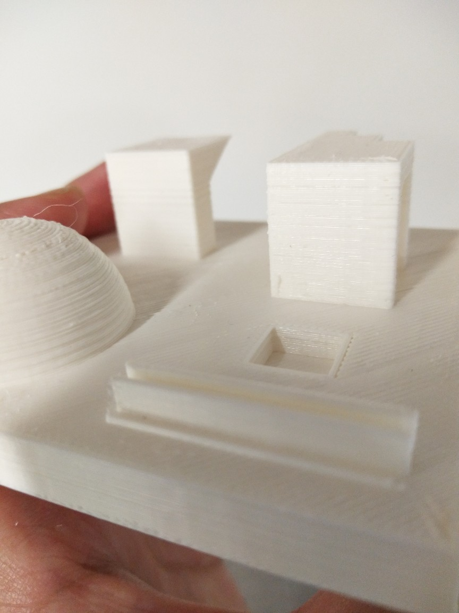

## 2. Build my own design: Pokeball 
### 2.1 Design with Rhino
First, I download a picture of pokeball online to mimic.

Then I try to build a sphere and cut two parts of it.

Then it hit me that only a single sphere may not get the support so a build a pedetal to support it.

Then I created the mesh object with the following parameters.

Fianlly transfer it to .stl file and import it into 3D printer software. And we get the preview. You can download my source file below.

#### [3dm file](PokeBall\Pokeball.3dm) and  [stl file](PokeBall\Pokeball.stl)
### 2.2 Modify and get the result
It can be seen from above that there are many support column in the preview. It is because I check the "support" option in the software. And the result we get first is quite not beautiful. So let's get rid of these redundant material. And eventually get what we want. A pokeball!

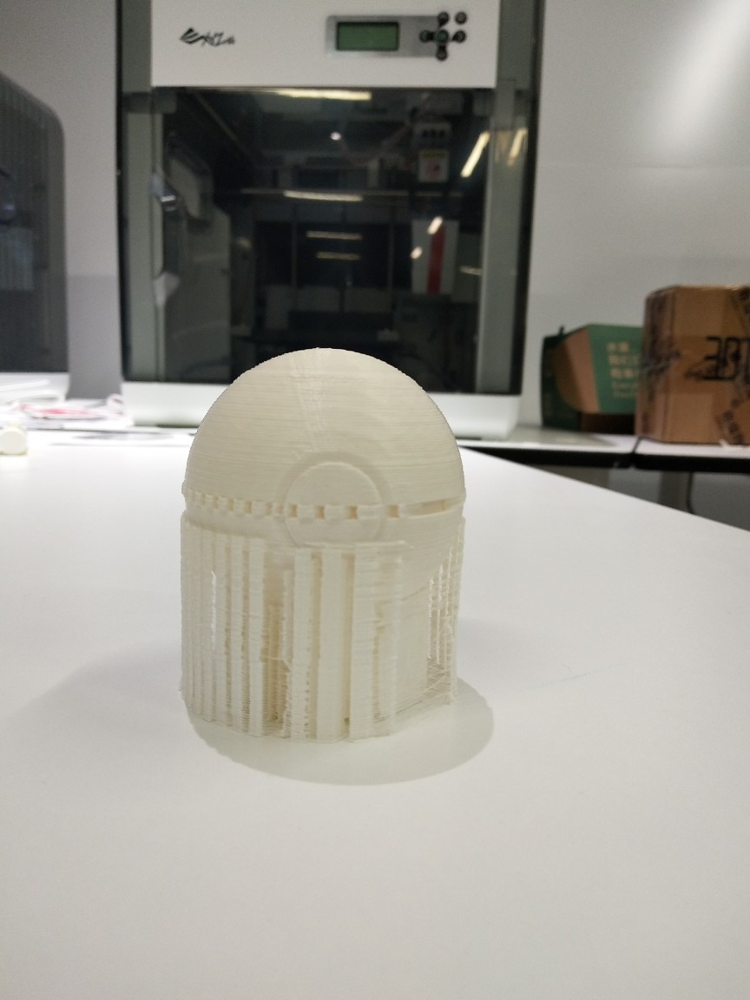
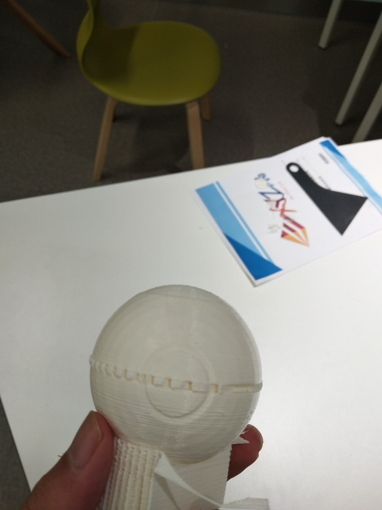
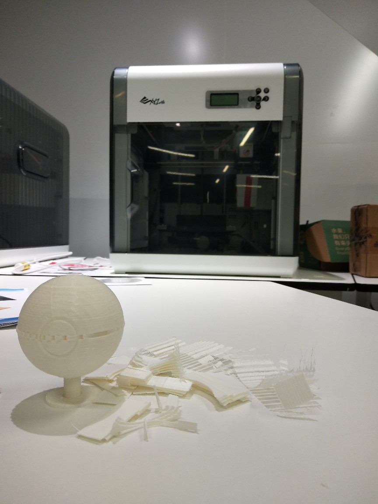
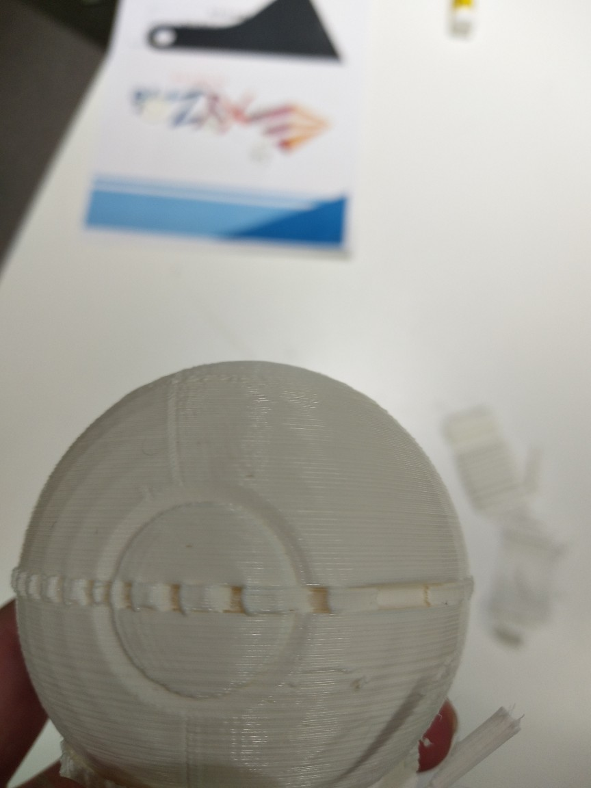
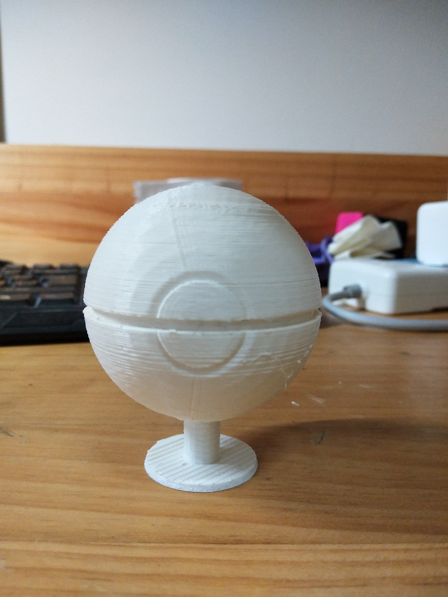

## [Go back to index](..\index.md)
