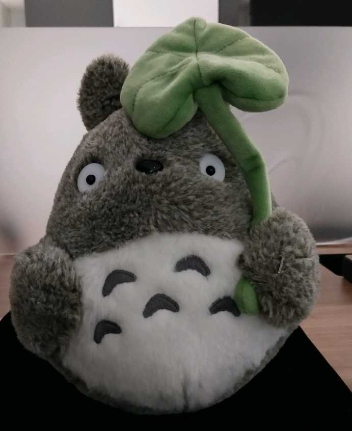
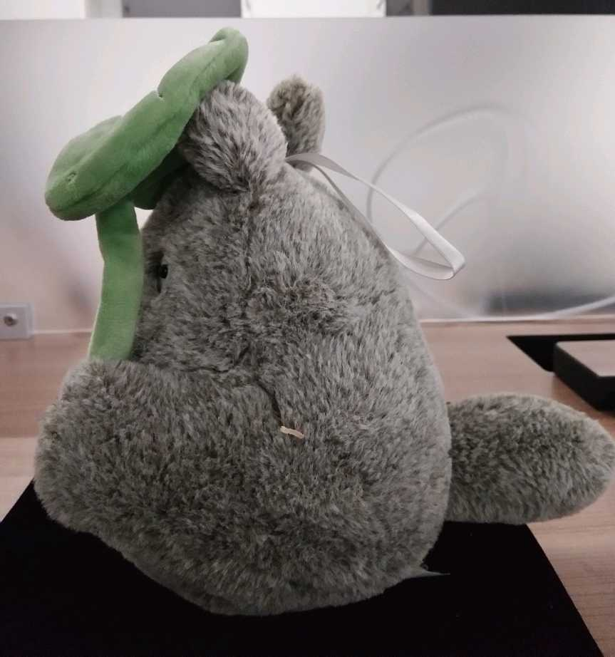
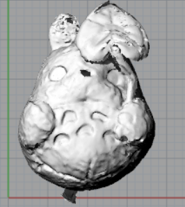
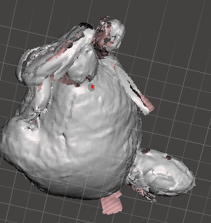
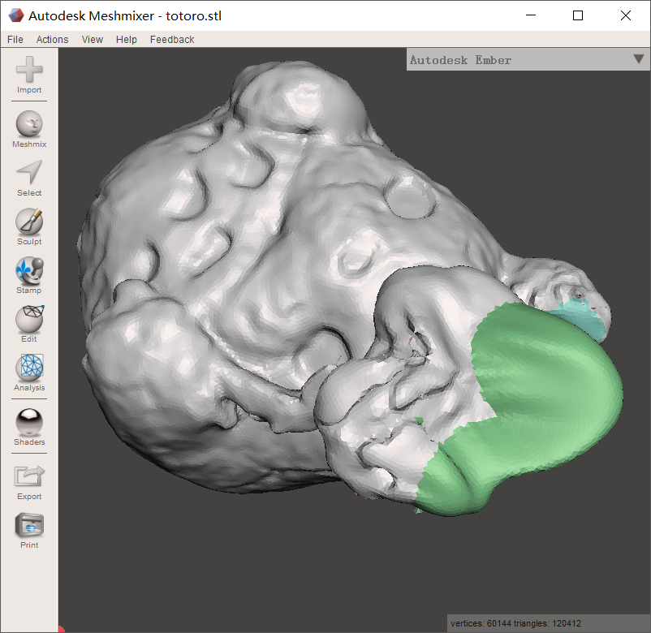
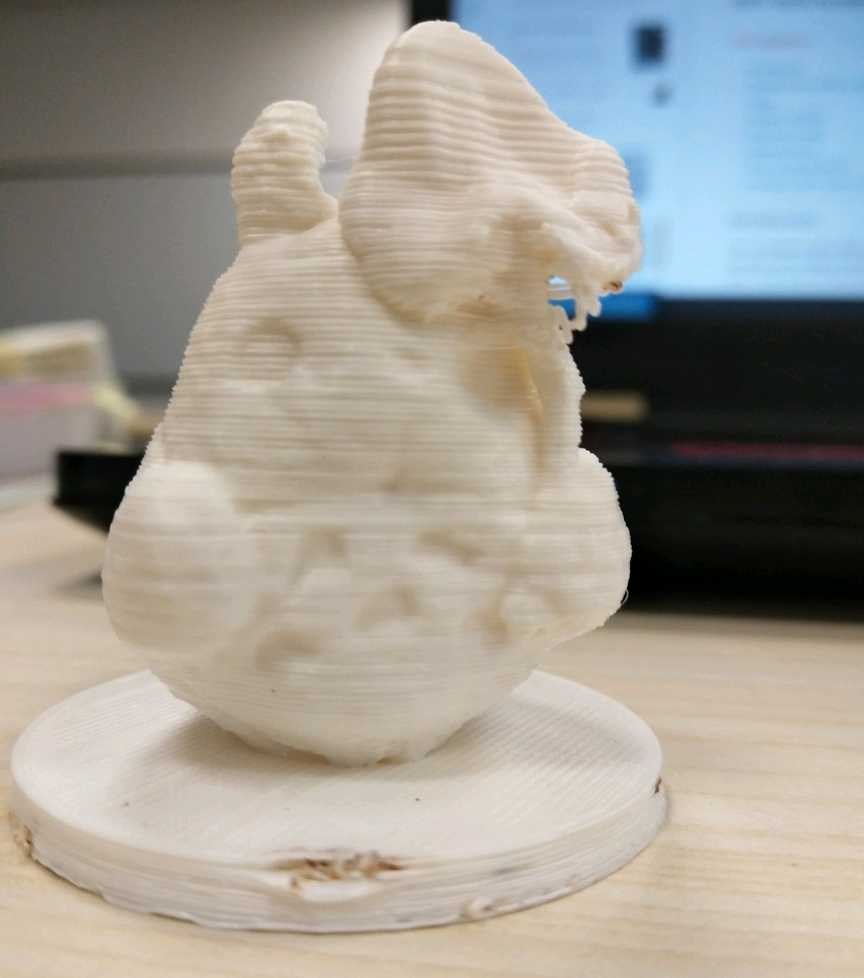

# WEEK4: A totoro with 3D scanner

 
## 1 Basic ways of 3D scanner

Basically, there are two ways to "change atoms to bits". One is to use the professional device with high technology. Another way is to use take pictures and use algorithm in the software.

In the class, the teachers introduced both ways. One with the expensive devices our school bought and the latter way with kinect. In this example, I use the fancy one to build a totoro with the model I win from clip doll machine.

## 2 Play with the 3D scanner
At first, I want to try the turntable to get high accuracy, but the model is too big and cover up the characristic symbols on the turntable.

So I try to use the "hand-hold mode", but since the inaccuracy of the mode, i.e. my hand cannot always keep the proper distance, is always comes out with the error "lost the trace of the object".

Finally I put the divice on the holder and keep it static while I move the model slightly and get the result.

## 3  Fix the mesh with meshmixer.
After I transfer the model to mesh form, I can see some annoying holes on the object. In order to fill the hole, I use the software [meshmixer](http://www.meshmixer.com/) and get the filled mesh model.

## 4. Add something to to the object and print
In rhino, I add a simple pedestal to the totoro ( I was not able to come up with interesting ideas, if you have, please let me know ), and print it with the argument 0.1mm, no support.

## [Go back to index](..\index.md)

