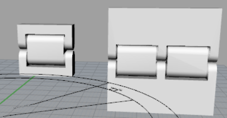
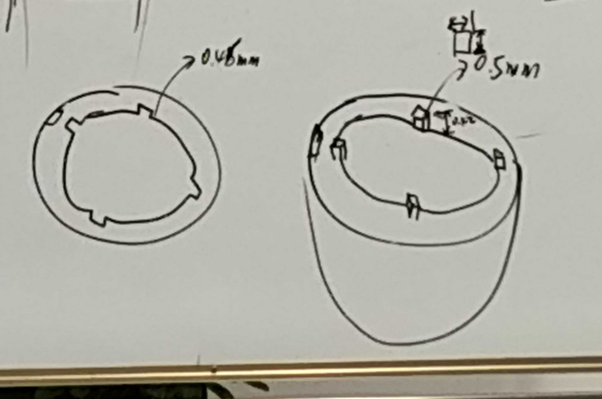
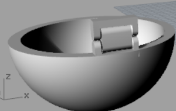
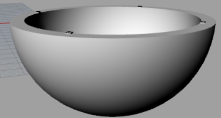
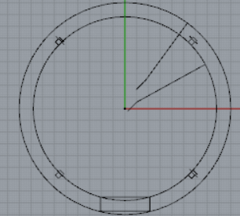

# WEEK5: Workshop Combining Laser Cut and 3D Printer

## 1. Brainstorm about how to make a Pokeball that can be opened

In the class, we asked the teacher about how to make a Pokeball that can be opened. We had troubles to design a hinge. The teacher hinted that we can find a design on [the website](https://www.thingiverse.com/). So we found a sophisticated hinge design and downloaded [here](https://www.thingiverse.com/thing:1096475). But it is quite large and may waste material, so we cut it into half, like this.

Also, when it came to how to use both laser cut and 3D printer, we made a lot of designs on the white board. The left part can be done by laser cut while the right part can be done by 3D printer.

## 2. Design with Rhino
First, I create a sphere and cut it into hollow and cut it half. Then I import the motified hinge and combine it with a semisphere.

Second, I try to design the part with four cubes on it. I find out that the size of cubes should be changed to fit the size of hinge and semishere. So I increase it into 2mm with height 0.42 mm. Then we get another part of the Pokeball.

Finally, to design the laser cut part and it should fit both hinge and cubes.

### You can find the source file [here](Pokeball.3dm)
## [Go back to index](../index.md)