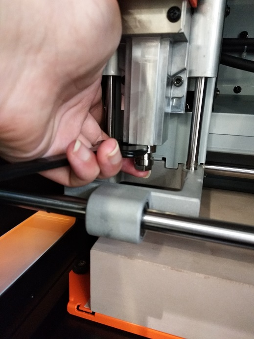
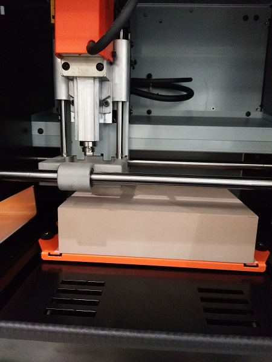
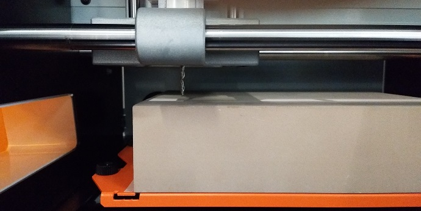
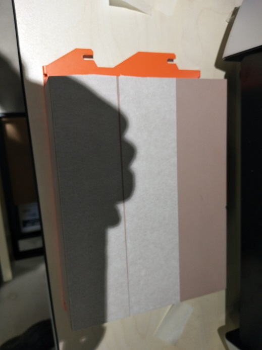
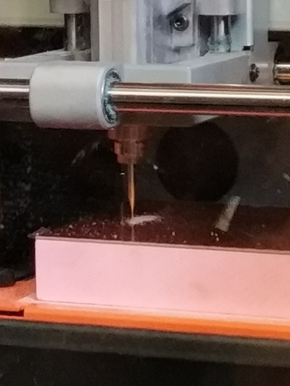
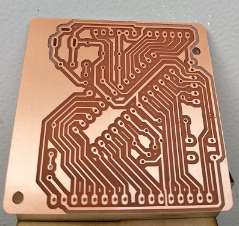

# WEEK6: Play with mill (PCB print)
## 1. Generate rml file
In the class, the teacher give us three png file designed by eagle(a PCB design software), then we go to the the [website](www.fabmodules.org) and generate the rml file that can be sent to the SRM-20 mechine.

Steps needed to be done:
- import the png file, select rml file, choose 1/64 for the first png file and 1/32 for the second and third png file.
- Then on the right side of the website, select the machine type, SRM-20. Then most parameters are set automatically, we only need to change the offset to be 0.
- click  the caculate and save the file.

## 2. Play with the SRM-20 machine.
### 2.1 Made a perfectly flat surface.
Since we do not know if the given surface is flat or not, it is important for us to make it by ourselves. Fortunately, there is a software will help us. What we need to do is to put the right mill onto the machine and select material hard wood and click cut.

### 2.2 Print the PCB.
Basically, there are three steps:
- Attach the board to the surface. 
- Put the drill with 1/64mm onto the machine and import the "1.rml" file to cut. 
- Change the drill with 1/32 onto the machine and import both "2.rml" and "3.rml" file to cut.
The finally, we get the board printed!

### You can find the source file [here](week6.zip)
## [Go back to index](../index.md)