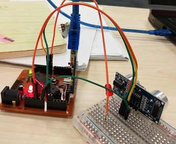
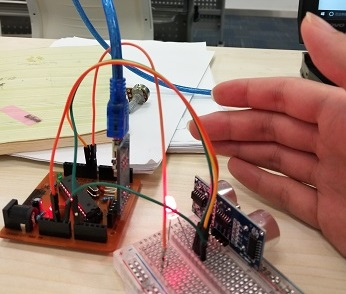

# WEEK8: Program with arduino

## 1. Introduction to arduino
Arduino is a kind of mircoccontroller which can be programed by C. There are many useful resources on this [website](https://www.arduino.cc/).

## 2. A distance detector with arduino

### 2.1 Learn about Ultrasonic Ranging Module 

I use a Ultrasonic Ranging Module HC-SR04 whose datasheet can be found [here](HCSR04.pdf).

In when the module was trigered by a pulse signal, it will send out an burst of ultrasound and will output an echo signal.  Then the range = high level time * velocity (340M/S) / 2. So we get the distance.

## 2.2 Connect the component.
- Echo -> A0

- Trig -> digital 8




## 2.3 Program with arduino
	
```c
	int TrigerPin=9 ; // output
	int ReadPin=A0; 
	int delayTime=100;
	int WarningLightPin=8;
	int WorkingPin=13;
	double threhold=15;
	double duration,range;
	void setup(){
  	Serial.begin(9600);
  	pinMode(TrigerPin,OUTPUT);
  	pinMode(WarningLightPin,OUTPUT);
  	pinMode(WorkingPin,OUTPUT);
	}

	void DonotTouchMe()
	{
    	digitalWrite(WarningLightPin,HIGH);
    	digitalWrite(WorkingPin,LOW);
	}

	void Fine()
	{
  		digitalWrite(WarningLightPin,LOW);
  		digitalWrite(WorkingPin,HIGH);
	}

	void loop() 
	{
  		digitalWrite(TrigerPin,HIGH);
  		delay(10);
  		digitalWrite(TrigerPin,LOW);
  		duration = pulseIn(ReadPin, HIGH);
  		range= duration/2/29.1;
  		//Serial.println(range);
  		if(range< threhold) DonotTouchMe();
  		else Fine();
  		delay(delayTime); 
	}
```


## [Go back to index](../index.md)